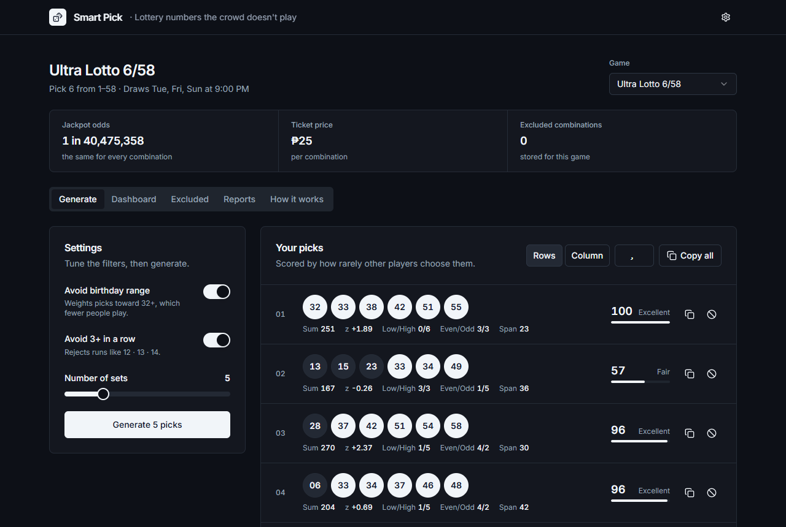

# Smart Pick

Lottery numbers the crowd doesn't play.

**Live app: [dmzmrn.github.io/SmartPicks](https://dmzmrn.github.io/SmartPicks)**



Every lottery combination has exactly the same chance of being drawn — no tool can
change that. What you *can* change is how many people you share the jackpot with.
Smart Pick generates combinations that avoid the numbers and patterns other players
favor, so if you win, you are more likely to keep the whole prize.

It runs entirely in your browser: no account, no backend, no tracking.

## Features

- **Generate** — produce 1–20 sets at a time. Each set gets a 0–100 crowd score and
  can be copied or added to your excluded list.
- **Dashboard** — every set you generate is saved and analyzed: how far your picks
  sit from the birthday range, set totals, number frequency, and a check against
  real past draws.
- **Excluded** — keep a list of combinations to skip (import, export, or paste).
  Use all of it, only the most recent entries, or none.
- **Reports** — upload past draw results for charts: sums over time, number
  frequency, odd/even and low/high splits, a frequency heatmap, and a sortable table.
- **How it works** — every rule explained in plain language, with sources.
- Presets for PCSO **6/58, 6/55, 6/49, 6/45 and 6/42**, plus a custom game
  (pick 1–20 numbers from up to 99).
- Light, dark or system theme, with Slate, Blue or Teal accents.

## How the crowd score works

The score is the share of all possible combinations that other players choose more
often than yours. A score of 90 means 90% of combinations are more crowded; a random
combination averages exactly 50.

The model was fitted to **3,086 real PCSO draws** (6/55 and 6/58) and their jackpot
winner counts, using Poisson regression. Two effects stood out:

| Effect | Multiplies expected co-winners by |
|---|---|
| Each number from 1–31 (birthday range) | ≈ 1.6× |
| Every number from 1–31 | a further ≈ 4× |

Evenly spaced tickets are the extreme case: on 1 October 2022, 433 people shared the
Grand Lotto 6/55 jackpot because the winning numbers were 9 · 18 · 27 · 36 · 45 · 54.
Such sets score 0 and the generator never produces them.

Full method, results and tests: [docs/RESEARCH_LOG.md](docs/RESEARCH_LOG.md).

## Generator rules

Numbers are drawn with cryptographically secure randomness
(`crypto.getRandomValues`) and Efraimidis–Spirakis weighted sampling, then every set
must pass these rules:

| Rule | Effect |
|---|---|
| Avoid birthday range (toggle) | Weights 1–12 at 0.18, 13–31 at 0.40, 32+ at 1.00 |
| Avoid 3+ in a row (toggle) | Rejects runs like 12 · 13 · 14 |
| Evenly spaced pattern | Rejects sets where all numbers, or all but one, are equally spaced |
| Sum window | Rejects totals outside μ − 1.5σ to μ + 2.75σ |
| Parity and range | Rejects all-even, all-odd and all-low sets (and all-high when birthday weighting is off) |
| Spread | Rejects sets whose lowest-to-highest gap is under 40% of the range |
| Ending digits | Rejects four or more numbers sharing a last digit |
| Excluded list | Rejects any combination on your active excluded list |

For the standard games every rule always holds. If a small custom game can't satisfy
them all, the app loosens the minor rules one at a time and tells you which.

## Loading past draws

The Reports tab accepts `.txt` or `.csv` files with one draw per line. Dashes,
spaces, commas and extra columns (game name, date, jackpot amount) are all handled.
Add the jackpot winner count as the **last** field to unlock the winner analysis on
the Dashboard:

```text
01-42-23-26-46-32 0
6/58 05-11-22-33-44-55 09/17/2024 51,120,000.00 2
03 08 19 27 38 49
```

Files are read in your browser and never uploaded anywhere.

## Getting started

Requires **Node.js 20.19+ or 22.12+**.

```bash
npm install
npm run dev       # http://localhost:5173/SmartPicks/
npm test          # statistical test suite (Vitest)
npm run build     # production build in dist/
```

## Deployment

Every push or merge to `master` runs the tests, builds the app and publishes
`dist/` to the `gh-pages` branch
([.github/workflows/deploy.yml](.github/workflows/deploy.yml)). A failing test stops
the deploy.

To publish by hand instead: `npm run build && npm run deploy`.

## Recalibrating the crowd score

With your own draw files (winner count as the last field):

```bash
node scripts/calibrate-crowd-model.mjs 6/55=6-55.txt 6/58=6-58.txt
```

It prints the fitted coefficients, their standard errors and permutation-test
p-values. Update the constants in `src/lib/scoring.js` if they change.

## Project structure

```text
src/
  App.jsx                 app shell, tabs, shared state
  components/             Generate / Excluded / How it works tabs, shared UI
    ui/                   shadcn/ui primitives
  lib/
    generator.js          secure RNG, weighted sampling, filter cascade
    patterns.js           evenly spaced pattern detection
    scoring.js            calibrated crowd score
    stats.js              sum statistics, odds
    parsing.js            draw and combination file parsing
    storage.js            per-game localStorage
    __tests__/            statistical test harness
  modules/
    dashboard/            Dashboard tab (lazy-loaded)
    reports/              Reports tab (lazy-loaded)
scripts/
  calibrate-crowd-model.mjs
docs/
  RESEARCH_LOG.md         every engine change, why, and how it was verified
```

Built with React 18, Vite, Tailwind CSS, shadcn/ui and Recharts.
The full product spec is in [BRIEF.md](BRIEF.md).

## Disclaimer

Smart Pick is not affiliated with PCSO or any lottery operator. It cannot predict
draws or improve your odds of winning — every combination is equally likely. It only
lowers the chance of sharing a prize. Play for entertainment, and never spend money
you can't afford to lose.
